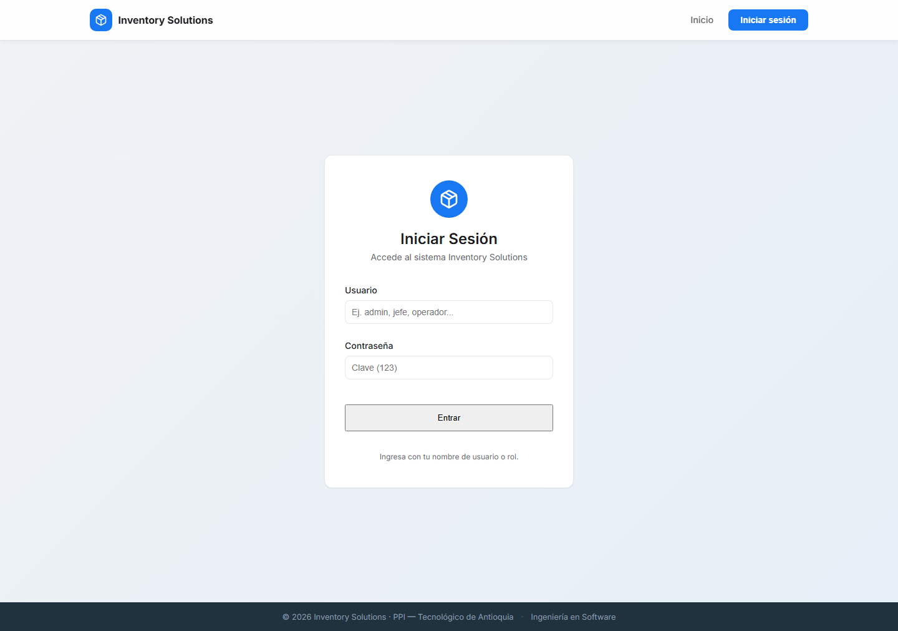
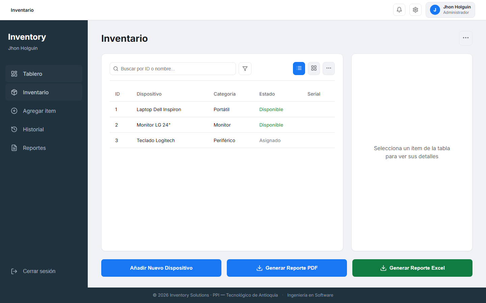
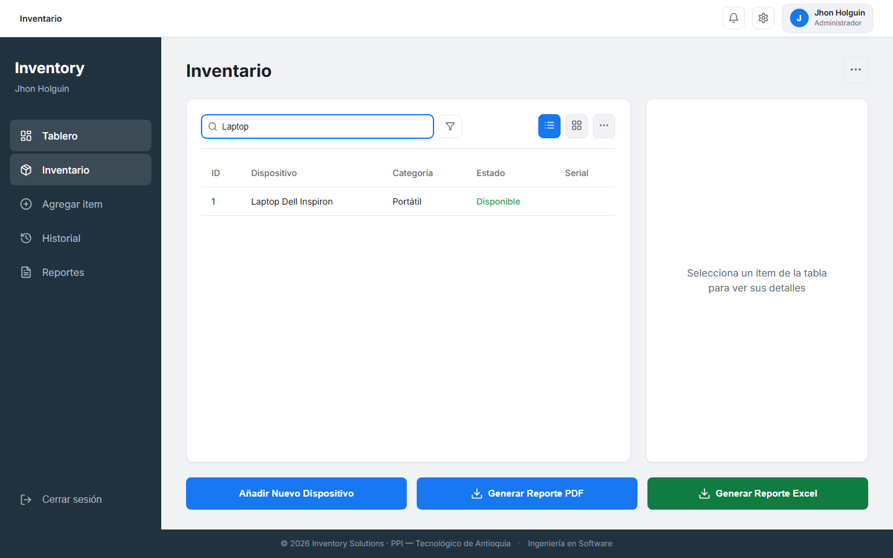
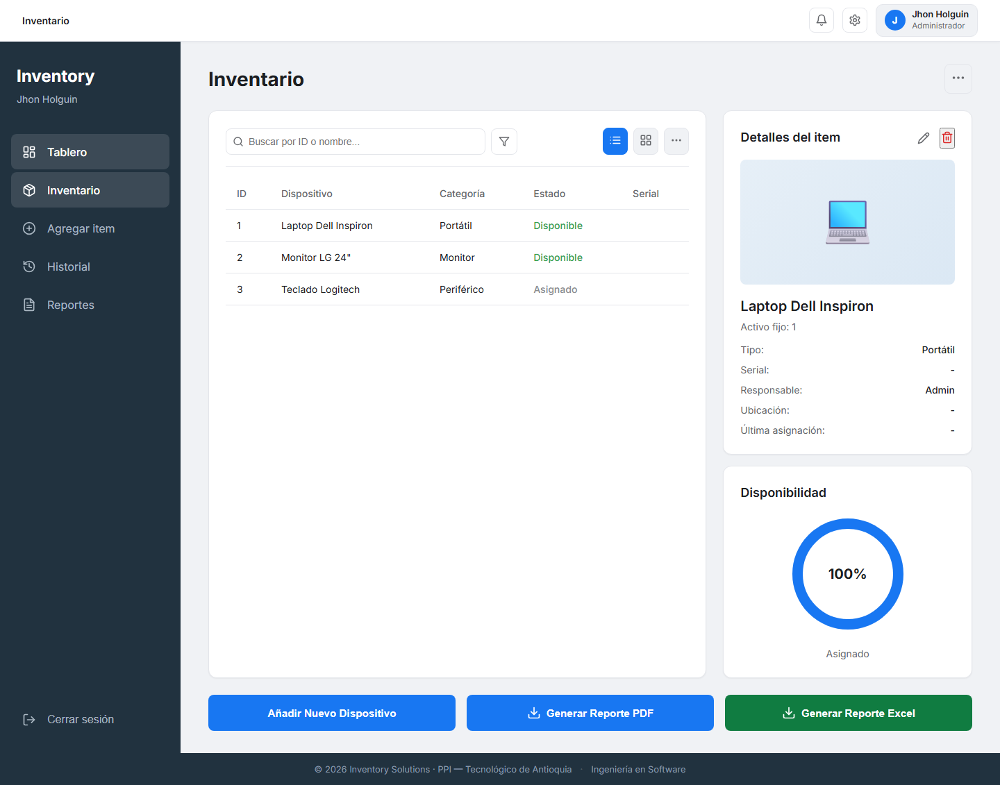
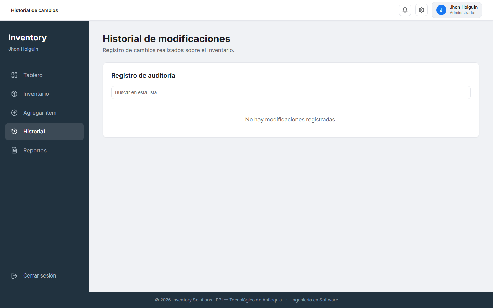
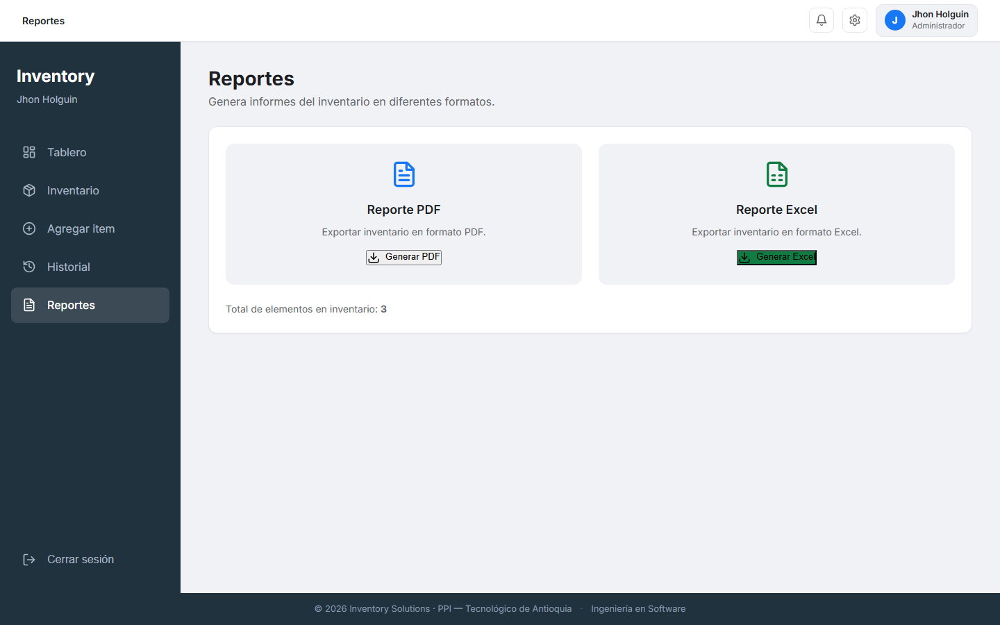

# Guia de funcionamiento paso a paso

## Paso 1. Iniciar sesion

1. Abre la pantalla de acceso.
2. Escribe usuario y contrasena.
3. Presiona Iniciar sesion.

## Paso 2. Ubicar el dashboard

1. En la barra lateral veras las secciones principales.
2. En el panel central aparece la tabla de inventario.
3. A la derecha se muestran los detalles del equipo.

## Paso 3. Buscar y filtrar equipos

1. Usa el campo de busqueda por ID o nombre.
2. Activa el filtro para limitar resultados por categoria.
3. Verifica que la tabla muestre solo lo necesario.

## Paso 4. Revisar detalles de un item

1. Haz clic sobre una fila de la tabla.
2. Revisa datos tecnicos, responsable y estado.
3. Si tu rol lo permite, puedes editar o eliminar.

## Paso 5. Generar salidas y registrar equipos

1. Usa Generar PDF para reporte rapido.
2. Usa Generar Excel para analisis.
3. Usa Agregar equipo para nuevos activos.

## Paso 6. Historial y auditoria

1. Entra en Historial para ver cambios por fecha.
2. Consulta Reportes para resumenes de gestion.
3. Usa esta vista para seguimiento y auditoria interna.

## Paso 7. Reportes

1. Entra a Reportes desde el menu lateral.
2. Genera informe PDF o Excel segun necesidad.
3. Verifica el total de elementos al final de la vista.

## Recomendacion para presentacion

1. Proyecta esta guia en paralelo con la aplicacion.
2. Explica cada paso y luego demuestralo en vivo.
3. Entrega este archivo como manual rapido al equipo.
